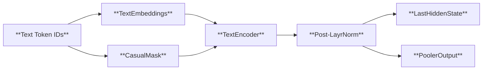
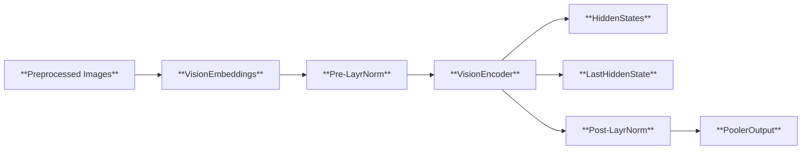
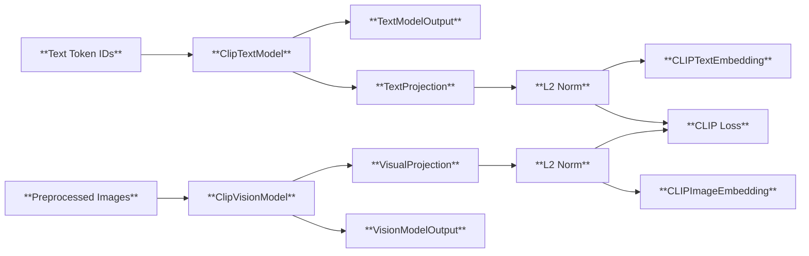

# [CLIP (Contrastive Language-Image Pretraining) Literature Review Summary](../../mlx-examples/clip)

## 1. Introduction
**CLIP** (Contrastive Language-Image Pretraining) is a multimodal pretraining model developed by OpenAI that learns to align text and image 
representations. It is designed to understand and generate relationships between visual and textual data, enabling tasks such as zero-shot 
classification, image-text matching, and cross-modal retrieval.

---

## 2. Key Contributions
### 2.1. Multimodal Pretraining
- **Contrastive Learning**: CLIP uses a contrastive learning framework to align image and text embeddings. It maximizes the similarity between 
matching image-text pairs while minimizing the similarity between mismatched pairs.
- **Large-Scale Data**: Trained on 400 million (image, text) pairs from the internet, CLIP leverages vast and diverse data to learn 
generalizable representations.

### 2.2. Zero-Shot Generalization
- CLIP achieves strong performance on **zero-shot** tasks (e.g., classification without task-specific training) by learning a shared embedding 
space for text and images.
- It can generalize to unseen classes by leveraging textual descriptions, making it highly flexible for real-world applications.

### 2.3. Efficient Architecture
- **Modular Design**: CLIP uses separate encoders for images (e.g., ResNet) and text (e.g., Transformer), allowing flexibility in model 
customization.
- **Scalability**: The model can be scaled to larger architectures (e.g., ViT, GPT) to improve performance.

---

## 3. Methodology
### 3.1. Training Objective
- **Contrastive Loss**: CLIP minimizes the **InfoNCE loss** (a contrastive loss) to align image and text embeddings. The objective is:
  $$
  \mathcal{L} = -\log \frac{\exp(\text{sim}(x_i, t_i)/\tau)}{\sum_{j=1}^N \exp(\text{sim}(x_i, t_j)/\tau)}
  $$
  where $x_i$ is an image, $t_i$ is the corresponding text, and $\tau$ is a temperature parameter.

### 3.2. Model Architecture
- **Image Encoder**: Typically based on ResNet-50 or Vision Transformer (ViT).
- **Text Encoder**: Based on the Transformer architecture (e.g., GPT-2).
- **Shared Embedding Space**: Both encoders map inputs to a common latent space, enabling cross-modal alignment.

### 3.3. Data Collection
- **Web-Crawled Dataset**: CLIP uses a large-scale dataset of image-text pairs from the internet (e.g., CommonCrawl, WebText).
- **Filtering**: Data is filtered to ensure high-quality and diverse examples.

---

## 4. Experimental Results
### 4.1. Zero-Shot Classification
- CLIP outperforms previous methods on zero-shot classification benchmarks (e.g., ImageNet, Food101, Cars196).
- Example: On ImageNet, CLIP achieves **88.1% accuracy** without any task-specific training.

### 4.2. Cross-Modal Retrieval
- CLIP excels in tasks like **image-to-text** and **text-to-image** retrieval.
- It achieves state-of-the-art results on datasets like **COCO** and **Flickr30K**.

### 4.3. Robustness
- CLIP demonstrates strong performance even when faced with out-of-distribution data or noisy inputs.

---

## 5. Limitations
### 5.1. Data Bias
- The model's performance depends heavily on the quality and diversity of the training data. Biases in the dataset can propagate to the model.

### 5.2. Computational Cost
- Training CLIP requires significant computational resources (e.g., 1,000+ GPUs), making it less accessible for small-scale research.

### 5.3. Interpretability
- While CLIP achieves strong performance, the internal mechanisms of how it aligns text and images are not fully understood.

---

## 6. Applications
- **Image Captioning**: Generate descriptive text for images.
- **Visual Question Answering (VQA)**: Answer questions about images using text.
- **Multimodal Search**: Search for images using natural language queries.
- **Content Moderation**: Detect inappropriate content by analyzing both text and images.

---

## 7. Comparison with Other Models
| Model          | Pretraining Method | Zero-Shot Performance | Scalability | Resource Intensity |
|----------------|--------------------|------------------------|-------------|---------------------|
| CLIP           | Contrastive Learning | High                  | High        | High                |
| ALIGN          | Contrastive Learning | Moderate              | Moderate    | Moderate            |
| ViLT           | Vision Transformer + Transformer | Moderate | Moderate | Moderate            |
| BLIP           | Vision Transformer + Transformer | High | High | High                |

---

## 8. Conclusion
CLIP represents a significant advancement in multimodal learning, enabling robust alignment between text and images. Its ability to generalize 
to unseen tasks without fine-tuning makes it a versatile tool for a wide range of applications. However, challenges such as data bias and 
computational costs remain areas for future research.

---

## 9. References
- Radford, A., Kim, J.W., Hallacy, C., et al. (2021). **Learning Transferable Visual Models From Natural Language Supervision**. *arXiv preprint 
arXiv:2103.00028*.
- OpenAI. (2021). **CLIP: Contrastive Language-Image Pretraining**. [https://openai.com/blog/clip/](https://openai.com/blog/clip/)
- Zhang, H., et al. (2021). **ViLT: Vision-and-Language Pre-training Without Explicit Vision**. *arXiv preprint arXiv:2107.00102*.

---
## 10. Code Explanation: [CLIP Inference Pipeline](../../mlx-examples/clip/clip.py)

The following code demonstrates how to load a CLIP model, process text and image inputs, and perform inference using the `mlx` framework. This example leverages Hugging Face's `CLIPProcessor` and OpenAI's CLIP architecture. The [clip.py](../../mlx-examples/clip/clip.py) script is Apple's implementation of the Huggingface `CLIPProcessor` including `CLIPTokenizer` and `CLIPImageProcessor` while the [hf_preproc.py](../../mlx-examples/clip/hf_preproc.py) script is the standard Huggingface `CLIPProcessor`.

### 10.1. Key Steps
1. **[Model and Processor Initialization](../../mlx-examples/clip/clip.py#L8)**

- `CLIPModel.from_pretrained("openai/clip-vit-base-patch32")`: Loads a pre-trained CLIP model with a Vision Transformer (ViT) encoder for images and a Transformer encoder for text.

- `CLIPProcessor`: Handles text tokenization and image preprocessing (e.g., normalization, resizing).

2. **[Input Processing](../../mlx-examples/clip/clip.py#L19)**

- Text inputs are tokenized into `input_ids` (with `[CLS]` and `[SEP]`) and attention masks.
- Image inputs are normalized and converted into tensors.

3. **Inference**

- The model computes embeddings for both text and images, aligning them in a shared latent space.
- The `loss` value quantifies how well the model aligns matching image-text pairs (contrastive learning).

4. **[Output Interpretation](../../mlx-examples/clip/clip.py#L27)**

- `text_embeds` and `image_embeds` represent high-dimensional embeddings (in `multimodal embedding spaces`) for downstream tasks (e.g., zero-shot classification, retrieval).
- The `loss` is minimized during training to ensure embeddings of matching pairs are closer than mismatched ones. (`CLIP loss: 0.006`)

### 10.2. Technical Notes

- **Contrastive Learning**: CLIP uses the InfoNCE loss to maximize similarity between correct image-text pairs and minimize it for incorrect ones.

- **Scalability**: The model can be scaled to larger architectures (e.g., ViT-16, GPT-3) for improved performance.

- **Efficiency**: The modular design allows separate optimization of image and text encoders.

---

## 11. Code Explanation: [Linear Probe and CLIP embedding](../../mlx-examples/clip/linear_probe.py)

### 11.1. What is a Linear Probe?
A **linear probe** is a technique to evaluate the quality of learned representations by training a simple linear classifier (e.g., logistic regression) on top of frozen pre-trained features. In CLIP, this involves:
- Extracting image/text embeddings from the pre-trained model
- Training a linear model on these embeddings for downstream tasks

### 11.2. CLIP Embedding Performance on Linear Probes
- **Zero-shot capability**: Achieves strong performance on unseen classes via text-based supervision
- **Feature quality validation**: Demonstrates that CLIP's multimodal training produces discriminative features
- **Efficiency**: Avoids full model fine-tuning while maintaining high accuracy
- **Generalization**: Shows robustness across diverse datasets (e.g., CIFAR-10, ImageNet)

### 11.3. [Logistic Regression on Image Embeddings](../../mlx-examples/clip/linear_probe.py#L50)

- **[Feature extraction](../../mlx-examples/clip/linear_probe.py#L21)**: `get_image_features()` extracts normalized image embeddings
- **Linear classifier**: `LogisticRegression` acts as a simple readout layer
- **Evaluation metric**: Accuracy on test set demonstrates feature quality (`Accuracy = 95.030`)
- **Hyperparameters**: Regularization strength `(C=0.316)` balances overfitting

---

## 12. Code Explanation: [Image Processor](../../mlx-examples/clip/image_processor.py)

This file implements the `CLIPImageProcessor` class, responsible for preprocessing images for the CLIP model. It handles resizing, cropping, and normalization to prepare inputs for the Vision Transformer (ViT) encoder.

### 12.1. [Initialization Parameters](../../mlx-examples/clip/image_processor.py#L18)

- `crop_size`: Target size for center cropping (default: 224).
- `do_center_crop`: Whether to apply center cropping (default: True).
- `do_normalize`: Whether to normalize pixel values (default: True).
- `image_mean/image_std`: Mean and standard deviation for normalization (precomputed for CLIP).
- `size`: Target size for resizing (default: 224).

### 12.2. [Main Workflow](../../mlx-examples/clip/image_processor.py#L37)

The `CLIPImageProcessor` accepts a list of PIL images and returns a concatenated NumPy array (**Batch processing**). 

`self._preprocess(image)[None]` is used to add a new axis in the front. 

### 12.3. [Private Preprocessing Method](../../mlx-examples/clip/image_processor.py#L42)

- **[resize()](../../mlx-examples/clip/image_processor.py#L61)**: Adjusts image dimensions while maintaining aspect ratio.
- **[center_crop()](../../mlx-examples/clip/image_processor.py#L76)**: Crops the image to crop_size from the center.
- **[rescale()](../../mlx-examples/clip/image_processor.py#L88)**: Converts pixel values to float32 and scales to [0, 1].
- **[normalize()](../../mlx-examples/clip/image_processor.py#L92)**: Applies mean subtraction and standard deviation scaling.

### 12.4. [Pretrained Configuration Loading](../../mlx-examples/clip/image_processor.py#L54)

Loads configuration from a JSON file (e.g., `preprocessor_config.json`) for reproducibility.


In Python, a static method (`@staticmethod`) is a method that belongs to a class but does not require access to class or instance. (e.g. [img_processor = CLIPImageProcessor.from_pretrained(model_dir)](../../mlx-examples/clip/clip.py#L11) does not require Instantiation)

---

## 13. Code Explanation: [Tokenizer](../../mlx-examples/clip/tokenizer.py)

The `CLIPTokenizer` class implements a `byte-pair encoding (BPE) tokenizer` ported from Hugging Face's Transformers library. It processes text into token IDs using BPE merges and vocabulary mapping.

### 13.1. [Initialization](../../mlx-examples/clip/tokenizer.py#L14)

- **BPE Ranks**: Dictionary mapping token pairs to merge scores
- **Vocabulary**: Token to ID mapping
- **[Regex Pattern](../../mlx-examples/clip/tokenizer.py#L14)**: Tokenization pattern for text segmentation
  - `<|startoftext|>`: Matches the string `<|startoftext|>`. The `|` character needs to be escaped, so `\|` is used to represent the literal character.
  - `<|endoftext|>`: Similarly, matches the `<|endoftext|>` string.
  - `'s`, `'t`, `'re`, `'ve`, `'m`, `'ll`, `'d`: These are common contractions. For example, `'s` might represent `'s` (as in `"it's"`), `'t` might represent `'t` (as in `"don't"`), etc.
  - `[\p{L}]+`: Matches one or more Unicode letter characters (`\p{L}` represents letters in any language).
  - `[\p{N}]`: Matches a single Unicode numeric character (`\p{N}` represents numbers).
  - `[^\s\p{L}\p{N}]+`: Matches one or more characters that are neither whitespace, nor letters, nor numbers.
  - `regex.compile` compiles a regular expression pattern (a string) into a regular expression object for efficient subsequent matching, searching, etc.
- **Cache**: Stores already processed token sequences

### 13.2. [Property Decorator](../../mlx-examples/clip/tokenizer.py#L23)

`@property` is a decorator that implicitly defines class attributes. (e.g. `CLIPTokenizer.bos` returns `"<|startoftext|>"` without explicitly defining `self.bos = "<|startoftext|>"`)

### 13.3. [Byte Pair Encoding (BPE)](../../mlx-examples/clip/tokenizer.py#L39)

- **[Bigram Rank](../../mlx-examples/clip/tokenizer.py#L110)**: `bpe_merges` and `bpe_ranks` are the core data structures of `BPE (Byte Pair Encoding)` algorithm, which represent the `BPE merge rules` and `merge priority` respectively.
  - **[bpe_merges](../../mlx-examples/clip/tokenizer.py#L118)**: `bpe_merges` is a list where each element is a tuple representing a BPE merge rule. For example: `(‘a’, ‘b’)` means merge characters `‘a’` and `‘b’` into `‘ab’`.
    ```
    a b → ab
    c d → cd
    e f → ef
    bpe_merges = [('a', 'b'), ('c', 'd'), ('e', 'f')]
    ```
  - **[bpe_ranks](../../mlx-examples/clip/tokenizer.py#L119)**: `bpe_ranks` is a dictionary, the key is the tuple (merge rule) in `bpe_merges`, the value is the index (i.e., priority) of the rule in the `bpe_merges` list, and the index value (number) is used to quickly determine the priority of the merge rule. The smaller the index, the higher the priority.
    ```
    bpe_ranks = {('a', 'b'): 0, ('c', 'd'): 1}
    ```

- **[Initial Tokenization](../../mlx-examples/clip/tokenizer.py#L43)**: Splits text into characters with word-end markers (`</w>`)

- **[Bigram Generation](../../mlx-examples/clip/tokenizer.py#L44)**: Generate all neighboring character pairs (bigrams). (e.g. `unigrams = ['a', 'b', 'c'] → unique_bigrams = {('a', 'b'), ('b', 'c')}`)

- **[Iterative Merging](../../mlx-examples/clip/tokenizer.py#L53)**: Select the highest priority bigram in `self.bpe_ranks` each time (the smaller the value the higher the priority) for merging. Iterate through the unigrams, if the current pair of characters is equal to bigram, merge them into one string and skip the next character; otherwise keep the current character.
    ```
    unigrams = ['a', 'b', 'c'], bigram = ('a', 'b') → new_unigrams = ['ab', 'c']
    ```

- **[Caching](../../mlx-examples/clip/tokenizer.py#L80)**: Cache the token's corresponding unigrams (bigrams) for subsequent calls.

### 13.4. [Tokenizer](../../mlx-examples/clip/tokenizer.py#L87)

- **[Batch Processing](../../mlx-examples/clip/tokenizer.py#L88)**: If text is a `list`, the code iterates through each element of the `list`, calling `self.tokenize` recursively and converting the result to `mx.array`. if text is not a `list`, it performs the later logic to process a single `string`.
  
- **[Text Normalization](../../mlx-examples/clip/tokenizer.py#L94)**: `Lowercasing` & `Whitespace normalization`

- **[Tokenization Pattern](../../mlx-examples/clip/tokenizer.py#L95)**: Regex-based tokenization pattern
  ```
  r"""<\|startoftext\|>|<\|endoftext\|>|'s|'t|'re|'ve|'m|'ll|'d|[\p{L}]+|[\p{N}]|[^\s\p{L}\p{N}]+"""
  ```

- **[BPE Integration](../../mlx-examples/clip/tokenizer.py#L98)**: Applies BPE to each token and combines results into final token sequence.

- **[Special Tokens](../../mlx-examples/clip/tokenizer.py#L101)**: 
  - `BOS` (Beginning Of Sequence) token: `"<|startoftext|>"`
  - `EOS` (End Of Sequence) token: `"<|endoftext|>"`
  - Token ID conversion using vocabulary

---

## 14. Code Explanation: [CLIP Model](../../mlx-examples/clip/model.py)

The `CLIPModel` class implements the full Contrastive Language-Image Pretraining (CLIP) architecture, which aligns text and image representations in a shared latent space. Below is a detailed breakdown of its components and functionality:

### 14.1. [ClipTextModel](../../mlx-examples/clip/model.py#L195)
The architecture of `ClipTextModel` is as follows:

- **[TextEmbeddings](../../mlx-examples/clip/model.py#L174)**
  - Maps input token IDs to dense vectors using `token_embedding` and `position_embedding`.
  - Combines token and positional embeddings to form initial text representations.

- **[TextEncoder](../../mlx-examples/clip/model.py#L190)**
  A stack of **[EncoderLayer](../../mlx-examples/clip/model.py#L151)** modules, each containing:
  ```mermaid
  graph LR
  A[**Pre-LayrNorm**] --> B[**Multi-Head Attention**]
  B --> C[**Residual Connections**]
  C --> D[**Post-LayrNorm**]
  D --> E[**Feed-Forward Network**]
  ```
  - **[Multi-Head Attention](../../mlx-examples/clip/model.py#L83)**: Captures global dependencies in text.
  - **[Feed-Forward Network (FFN)](../../mlx-examples/clip/model.py#L137)**: Applies non-linear transformations.
  - **Residual Connections + LayerNorm**: Ensures stable training.

- **[CLIPTextOutput](../../mlx-examples/clip/model.py#L204)**
  - The `pooler_output` is extracted by taking the hidden state at the position of `the end-of-sentence (EOS) token` as the representaion of the entire sentence **(in the text latent space)**.
  - The `last_hidden_state` contains all token-level representations.
  
### 14.2. [ClipVisionModel](../../mlx-examples/clip/model.py#L261)
The architecture of `ClipVisionModel` is as follows:

- **[VisionEmbeddings](../../mlx-examples/clip/model.py#L219)**
  - **Patch Embedding**: Converts images into patches using a convolutional layer (`Conv2d`), flattening them into a sequence of vectors.
  - **Class Token**: A learnable `[CLS]` token is prepended to the patch embeddings.
  - **Positional Encoding**: Adds learnable positional embeddings to the sequence.
- **[Encoder](../../mlx-examples/clip/model.py#L190)**
  - Similar to the `text encoder`, but without `causal masking` (since images are non-sequential).
  - Outputs hidden states for all layers if `output_hidden_states` is enabled.
- **[CLIPVisionOutput](../../mlx-examples/clip/model.py#L288)**
  - The `[CLS]` token's representation is normalized and used as the representaion of the entire image **(in the image latent space)**.

### 14.3. **[CLIPModel](../../mlx-examples/clip/model.py#L295)**
The architecture of `CLIPModel` is as follows:



- **[Feature Extraction](../../mlx-examples/clip/model.py#L314)**
  - **[Text Features](../../mlx-examples/clip/model.py#L320)**: `text_model(input_ids)` → `CLIPTextOutput` with `pooler_output (text embeddings)`.
  - **[Image Features](../../mlx-examples/clip/model.py#L320)**: `vision_model(pixel_values)` → `CLIPVisionOutput` with `pooler_output (image embeddings)`.

- **[Projection Layers](../../mlx-examples/clip/model.py#L304)**
  - **[Text Projection](../../mlx-examples/clip/model.py#L308)**: Maps the `[EOS]` token's last hidden state to **the shared latent space** using a linear layer (`text_projection`).
  - **[Image Projection](../../mlx-examples/clip/model.py#L311)**: Similarly maps the image `[CLS]` token to **the shared space** via `visual_projection`.
  
- **[L2 Normalization](../../mlx-examples/clip/model.py#L323)**: Both text and image embeddings are `L2-normalized` to ensure the consistency of `cosine similarity`.

- **[Loss Function](../../mlx-examples/clip/model.py#L76)**
  - **InfoNCE loss**: The implemented `CLIP Loss` is the modified version of `InfoNCE Loss` for implementation efficiency and numerical stability by setting $\tau = exp(-\text{logit\_scale})$, which relaxes `logit_scale` to be free and guarantees the positivity of temperature parameter.
    $$
    \mathcal{L} = -\log \frac{\exp(\text{sim}(x_i, t_i)/  \tau)}{\sum_{j=1}^N \exp(\text{sim}(x_i, t_j)/\tau)}
    $$

  - **[Contrastive Loss (`clip_loss`)](../../mlx-examples/clip/model.py#L76)**: Computes logits as the dot product between text and image embeddings, scaled by `logit_scale`. The loss is computed using `cross-entropy`, treating each text-image pair as a positive example and all others as negatives.

  - **[Logit Scale](../../mlx-examples/clip/model.py#L340)**: `logit_scale` is a learnable parameter initialized to `0.0` (equivalent to `exp(0.0) = 1.0`), which controls the similarity magnitude.
  $$
  \begin{aligned}
    \text{Image Loss \ } \mathcal{L}_I &= -\log \frac{\exp(\text{sim}(T_i, I_i)*\tau)}{\sum_{j=1}^N \exp(\text{sim}(T_i, I_j)*\tau)} \\
    \text{Text Loss \ } \mathcal{L}_T &= -\log \frac{\exp(\text{sim}(T_i, I_i)*\tau)}{\sum_{j=1}^N \exp(\text{sim}(T_j, I_i)*\tau)} \\
    \text{CLIP Loss \ } \mathcal{L} &= (\mathcal{L}_I + \mathcal{L}_T) / 2 \\
    \text{Temperature \ } \tau &= exp(\text{logit\_scale})
  \end{aligned}
  $$